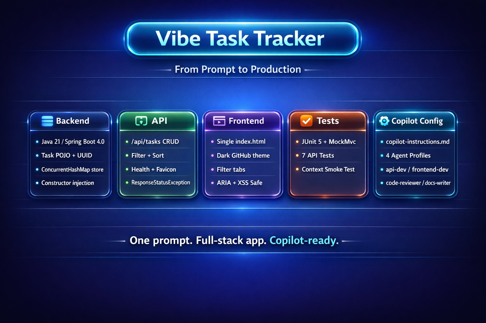

# ✨ Vibe Coding Workshop


A hands-on workshop project that demonstrates how to use GitHub Copilot effectively — beyond the hype. Built as a simple **Task Tracker** app.

## 🎯 What You'll Learn

1. **Start with Ask Mode** ([guide](docs/01-ask-mode.md)) — Open Copilot Chat and explore the codebase. Ask how the task model works, compare approaches, and understand existing patterns before touching any code.

2. **Switch to Plan Mode** ([guide](docs/02-plan-mode.md)) — Once you know what to build, describe it in Plan mode. Copilot analyzes your codebase and produces a step-by-step implementation plan. Refine it until you're satisfied. See [`PLAN.md`](PLAN.md) for an example plan generated by Plan Mode.

3. **Execute in Agent Mode** ([guide](docs/03-agent-mode.md)) — Hand the plan to Agent mode. Copilot edits multiple files, runs terminal commands, and self-corrects errors. You can also hand off sessions between local, CLI, and cloud agents.

4. **Configure with copilot-instructions.md** ([guide](docs/04-copilot-instructions.md)) — Teach Copilot your project's conventions. A single Markdown file at `.github/copilot-instructions.md` ensures every suggestion matches your coding style, tech stack, and error handling patterns.

5. **Specialize with Agent Profiles** ([guide](docs/05-agent-profiles.md)) — Define focused expert personas (API developer, code reviewer, frontend specialist, docs writer) in `.github/agents/`. Select them from the dropdown to get role-specific responses.

6. **Extend with MCP Tooling** ([guide](docs/06-mcp-tooling.md)) — Connect Copilot to external tools via MCP servers. This project includes four servers: filesystem access, GitHub integration, Playwright browser testing, and Microsoft Docs search. Try executing the testing plan in [`PLAN.md`](PLAN.md) to see Copilot drive a real browser through MCP.

## 📋 Prerequisites

### Dev Container / GitHub Codespace (zero local setup)

If you open this project in a **dev container** or **GitHub Codespace**, everything is pre-configured — no manual installation required. The container image (`mcr.microsoft.com/devcontainers/java:21-bookworm`) includes Java 21, Maven, and the GitHub CLI. It also auto-installs the recommended VS Code extensions (Java Pack, Spring Boot Tools, GitHub Copilot) and pre-downloads Maven dependencies on creation.

### Manual Installation

| Tool | Version | Notes |
|---|---|---|
| **Java JDK** | 21 or later | Required to compile and run the app. Download from [Adoptium](https://adoptium.net/) or [Oracle](https://www.oracle.com/java/technologies/downloads/). |
| **Maven** | 3.3.4+ | **Included** — the Maven Wrapper (`mvnw` / `mvnw.cmd`) is bundled in the repo, so no separate Maven install is needed. |
| **Git** | Any recent version | To clone the repository. |
| **Web browser** | Any modern browser | To access the frontend at `http://localhost:3000`. |

### Optional (for MCP Tooling)

| Tool | Version | Notes |
|---|---|---|
| **Node.js** | 18+ | Required for MCP servers — filesystem access, Playwright browser testing, and other MCP tools. Download from [nodejs.org](https://nodejs.org/). |


> **Verify your Java installation:**
> ```bash
> java -version   # should show 21+
> ```

## 🚀 Quick Start

```bash
# Build and run the Spring Boot app (uses the included Maven wrapper — no Maven install needed)
./mvnw spring-boot:run        # Linux / macOS
mvnw.cmd spring-boot:run      # Windows

# Open in your browser
# http://localhost:3000
```

## 📁 Project Structure

```
vibecoding/
├── .devcontainer/
│   └── devcontainer.json          # Dev container config (sandboxed environment)
├── .github/
│   ├── copilot-instructions.md    # Project conventions for Copilot
│   └── agents/
│       ├── api-dev.agent.md       # Backend API expert
│       ├── frontend-dev.agent.md  # Frontend UI expert
│       ├── code-reviewer.agent.md # Code review specialist
│       └── docs-writer.agent.md   # Documentation writer
├── .vscode/
│   └── mcp.json                   # MCP server configuration
├── src/
│   └── main/
│       ├── java/com/vibetracker/
│       │   ├── VibeTaskTrackerApplication.java  # Spring Boot entry point
│       │   ├── controller/
│       │   │   ├── TaskController.java          # Task API endpoints
│       │   │   ├── HealthController.java        # Health check endpoint
│       │   │   ├── FaviconController.java       # Favicon handler
│       │   │   └── GlobalExceptionHandler.java  # Centralized error handling
│       │   ├── model/
│       │   │   └── Task.java                    # Task POJO
│       │   └── repository/
│       │       └── TaskRepository.java          # In-memory task store
│       └── resources/
│           └── application.properties           # App configuration
├── public/
│   └── index.html                 # Frontend (HTML/CSS/JS)
├── docs/                          # Workshop guides (start here!)
│   ├── 01-ask-mode.md
│   ├── 02-plan-mode.md
│   ├── 03-agent-mode.md
│   ├── 04-copilot-instructions.md
│   ├── 05-agent-profiles.md
│   └── 06-mcp-tooling.md
├── PLAN.md                        # Example plan generated by Plan Mode
└── pom.xml                        # Maven build file
```

## 🛠️ Tech Stack

- **Runtime:** Java 21+
- **Backend:** Spring Boot 4.0 REST API
- **Build:** Maven
- **Frontend:** Vanilla HTML, CSS, JavaScript
- **Data:** In-memory (no database setup needed)

## 📋 API Endpoints

| Method | Path | Description |
|---|---|---|
| `GET` | `/api/tasks` | List all tasks (filter: `?completed=true\|false`) |
| `GET` | `/api/tasks/{id}` | Get a single task |
| `POST` | `/api/tasks` | Create a task (`{ "title": "..." }`) |
| `PUT` | `/api/tasks/{id}` | Update a task |
| `PATCH` | `/api/tasks/{id}/toggle` | Toggle task completion |
| `DELETE` | `/api/tasks/{id}` | Delete a task |
| `GET` | `/api/health` | Health check |


## 🛡️ Safe Auto-Approve with Dev Containers

When using Copilot's Agent mode, the **approvals dropdown** in the chat window lets you choose how tool calls (file edits, terminal commands) are approved:

| Mode | Behavior |
|---|---|
| **Allow** | You approve every action one by one |
| **Auto** | Copilot runs tools automatically without asking |

**Auto mode is powerful but risky on your local machine** — Copilot can delete files, run arbitrary commands, and modify system config without confirmation.

### Why Dev Containers Make Auto Mode Safe

This project includes a [dev container](.devcontainer/devcontainer.json) that runs your entire workspace inside an **isolated, disposable container**. When you open this repo in a dev container (or GitHub Codespace), every action Copilot takes is sandboxed:

- **File changes** only affect the container filesystem, not your host machine
- **Terminal commands** execute inside the container — they can't touch your local OS
- **If something goes wrong**, you can rebuild the container from scratch in seconds
- **Your host machine stays untouched** regardless of what Copilot does

### How to Use It

1. **Open in a dev container** — In VS Code, run `Dev Containers: Reopen in Container` from the command palette (or open in a GitHub Codespace)
2. **Set approvals to Auto** — In the Copilot Chat panel, click the approvals dropdown and select **Auto**
3. **Vibe with confidence** — Give Copilot complex, multi-step tasks and let it execute freely. The container is your safety net.

> **💡 Tip:** Always use a dev container or Codespace when enabling auto-approve. Never use auto mode on your bare local machine unless you fully trust the task scope.

## 🎶 The Vibe Coding Philosophy

Vibe coding isn't about giving up control — it's about **working at a higher level of abstraction**:

- **Ask** before you assume
- **Plan** before you code
- **Review** what the agent produces
- **Configure** Copilot with your conventions
- **Specialize** with Agent Profiles
- **Extend** its capabilities with MCP

## 🏗️ Recreate This Project



Want to rebuild this entire project from scratch using Copilot? Paste the prompt below into GitHub Copilot **Agent mode** and watch it generate the complete project — backend, frontend, tests, and all Copilot configuration files:

<details>
<summary><strong>Show recreation prompt</strong></summary>

Build a **Vibe Task Tracker** — a workshop project showing how GitHub Copilot turns an idea into a practical workflow: Ask mode to explore, Plan mode to shape the solution, and Agent mode to execute across files and tools. We'll also cover `copilot-instructions.md`, reusable `.agent.md` profiles, and MCP tooling — so you can move fast, stay grounded, and vibe code with more structure, context, and control.

**Backend:** Java 21 / Spring Boot 4.0 / Maven (include wrapper). `Task` POJO with UUID string `id`, `title`, `description` (optional, default `""`), `completed` (default false), `createdAt`/`updatedAt` (Instant). Store tasks in a `@Repository` backed by `ConcurrentHashMap` — no database. Use constructor injection everywhere, `ResponseStatusException` for errors, and a `@RestControllerAdvice` `GlobalExceptionHandler` that returns `{ "error": "..." }` and never exposes stack traces.

**API (`/api/tasks`):** GET (list, with optional `?completed=true|false` filter, sorted by createdAt desc), GET `/{id}`, POST (title required), PUT `/{id}` (partial update — only update fields present in the body), PATCH `/{id}/toggle` (flip completed), DELETE `/{id}` (204). Also add `GET /api/health` (status + timestamp) and a `GET /favicon.ico` → `/favicon.svg` redirect.

**Frontend (`public/index.html`):** Single file with inline `<style>` and `<script>`. Dark GitHub-inspired theme using CSS custom properties (`--bg: #0d1117`, `--surface: #161b22`, `--accent: #58a6ff`). Add-task form, All/Active/Completed filter tabs, task list with checkbox toggle + delete button (✕), strikethrough on completed, "X of Y completed" status bar, empty state, error state. Use `fetch()`, event delegation, DOM-based `escapeHtml()` for XSS protection, ARIA labels, `aria-live="polite"`, semantic HTML5, responsive max-width 640px.

**Tests:** JUnit 5 + `@SpringBootTest` + `@AutoConfigureMockMvc` + MockMvc. Test: list returns 200, create with valid title returns 201, create without title returns 400, get non-existent ID returns 404, create-then-toggle flips completed, delete non-existent returns 404, create-then-delete returns 204 then 404. Plus a `contextLoads()` smoke test.

**Copilot config:** `.github/copilot-instructions.md` covering tech stack, conventions (constructor injection, PascalCase/camelCase, small methods, proper HTTP status codes, `ResponseStatusException`, `@RestControllerAdvice`), API design, error handling, testing, and frontend patterns. Four `.github/agents/*.agent.md` with YAML frontmatter (`description`, `tools`) + guidelines + example interaction: **api-dev** (owns backend, tools: read/edit/search/execute), **frontend-dev** (owns `public/`, same tools), **code-reviewer** (read-only, tools: read/search, review checklist with severity levels), **docs-writer** (owns `docs/` + README, tools: read/edit/search).

Run on port 3000 with `spring.web.resources.static-locations=file:public/`. Build the project and make sure `./mvnw test` passes.

</details>

The full prompt is also available in [RECREATE-PROMPT.md](RECREATE-PROMPT.md).

## 📜 License

MIT
