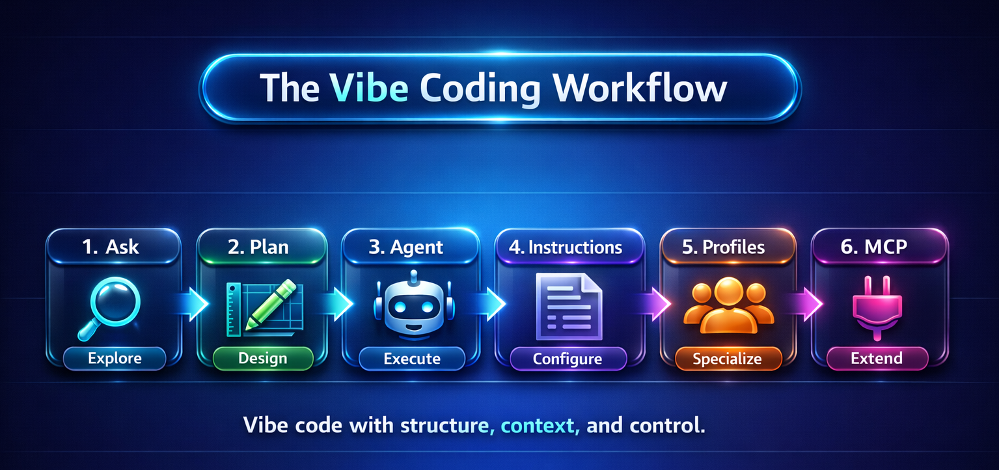

# ✨ Vibe Coding Workshop



A hands-on workshop project that demonstrates how to use GitHub Copilot effectively — beyond the hype. Built as a simple **Task Tracker** app.

## 🎯 What You'll Learn

| Concept | What It Is | Guide |
|---|---|---|
| **Ask Mode** | Explore ideas and understand code before building | [docs/01-ask-mode.md](docs/01-ask-mode.md) |
| **Plan Mode** | Shape a step-by-step solution before writing code | [docs/02-plan-mode.md](docs/02-plan-mode.md) |
| **Agent Mode** | Execute changes across files and tools | [docs/03-agent-mode.md](docs/03-agent-mode.md) |
| **copilot-instructions.md** | Teach Copilot your project's conventions | [docs/04-copilot-instructions.md](docs/04-copilot-instructions.md) |
| **Agent Profiles** | Define reusable, role-specific personas | [docs/05-agent-profiles.md](docs/05-agent-profiles.md) |
| **MCP Tooling** | Extend Copilot with external tools and data | [docs/06-mcp-tooling.md](docs/06-mcp-tooling.md) |

## 🚀 Quick Start

```bash
# Build and run the Spring Boot app (uses the included Maven wrapper — no Maven install needed)
./mvnw spring-boot:run

# Open in your browser
# http://localhost:3000
```

## 📁 Project Structure

```
vibecoding/
├── .github/
│   ├── copilot-instructions.md    # Project conventions for Copilot
│   └── agents/
│       ├── api-dev.agent.md       # Backend API expert
│       ├── frontend-dev.agent.md  # Frontend UI expert
│       ├── code-reviewer.agent.md # Code review specialist
│       └── docs-writer.agent.md   # Documentation writer
├── .vscode/
│   └── mcp.json                   # MCP server configuration
├── src/
│   └── main/
│       ├── java/com/vibetracker/
│       │   ├── VibeTaskTrackerApplication.java  # Spring Boot entry point
│       │   ├── controller/
│       │   │   ├── TaskController.java          # Task API endpoints
│       │   │   ├── HealthController.java        # Health check endpoint
│       │   │   ├── FaviconController.java       # Favicon handler
│       │   │   └── GlobalExceptionHandler.java  # Centralized error handling
│       │   ├── model/
│       │   │   └── Task.java                    # Task POJO
│       │   └── repository/
│       │       └── TaskRepository.java          # In-memory task store
│       └── resources/
│           └── application.properties           # App configuration
├── public/
│   └── index.html                 # Frontend (HTML/CSS/JS)
├── docs/                          # Workshop guides (start here!)
│   ├── 01-ask-mode.md
│   ├── 02-plan-mode.md
│   ├── 03-agent-mode.md
│   ├── 04-copilot-instructions.md
│   ├── 05-agent-profiles.md
│   └── 06-mcp-tooling.md
└── pom.xml                        # Maven build file
```

## 🛠️ Tech Stack

- **Runtime:** Java 21+
- **Backend:** Spring Boot 4.0 REST API
- **Build:** Maven
- **Frontend:** Vanilla HTML, CSS, JavaScript
- **Data:** In-memory (no database setup needed)

## 📋 API Endpoints

| Method | Path | Description |
|---|---|---|
| `GET` | `/api/tasks` | List all tasks (filter: `?completed=true\|false`) |
| `GET` | `/api/tasks/{id}` | Get a single task |
| `POST` | `/api/tasks` | Create a task (`{ "title": "..." }`) |
| `PUT` | `/api/tasks/{id}` | Update a task |
| `PATCH` | `/api/tasks/{id}/toggle` | Toggle task completion |
| `DELETE` | `/api/tasks/{id}` | Delete a task |
| `GET` | `/api/health` | Health check |

## 🧪 Workshop Flow


The workshop follows the six-stage pipeline shown in the diagram above. Each stage has a dedicated guide:

1. **Start with Ask Mode** ([guide](docs/01-ask-mode.md)) — Open Copilot Chat and explore the codebase. Ask how the task model works, compare approaches, and understand existing patterns before touching any code.

2. **Switch to Plan Mode** ([guide](docs/02-plan-mode.md)) — Once you know what to build, describe it in Plan mode. Copilot analyzes your codebase and produces a step-by-step implementation plan. Refine it until you're satisfied.

3. **Execute in Agent Mode** ([guide](docs/03-agent-mode.md)) — Hand the plan to Agent mode. Copilot edits multiple files, runs terminal commands, and self-corrects errors. You can also hand off sessions between local, CLI, and cloud agents.

4. **Configure with copilot-instructions.md** ([guide](docs/04-copilot-instructions.md)) — Teach Copilot your project's conventions. A single Markdown file at `.github/copilot-instructions.md` ensures every suggestion matches your coding style, tech stack, and error handling patterns.

5. **Specialize with Agent Profiles** ([guide](docs/05-agent-profiles.md)) — Define focused expert personas (API developer, code reviewer, frontend specialist, docs writer) in `.github/agents/`. Select them from the dropdown to get role-specific responses.

6. **Extend with MCP Tooling** ([guide](docs/06-mcp-tooling.md)) — Connect Copilot to external tools via MCP servers. This project includes a filesystem server for structured file access and a GitHub server for issue/PR management — and you can add databases, cloud APIs, and more.

## 🎶 The Vibe Coding Philosophy

Vibe coding isn't about giving up control — it's about **working at a higher level of abstraction**:

- **Ask** before you assume
- **Plan** before you code
- **Review** what the agent produces
- **Configure** Copilot with your conventions
- **Specialize** with Agent Profiles
- **Extend** its capabilities with MCP

## 📜 License

MIT
