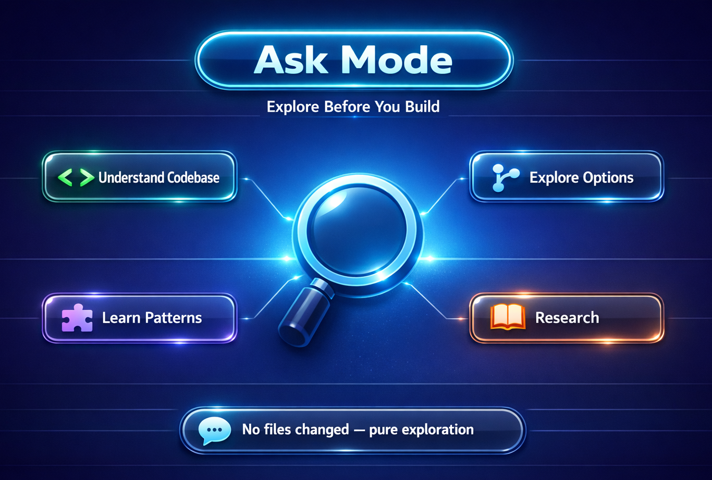

# 🔍 Ask Mode — Explore Before You Build



Ask mode is your starting point. Before writing any code, use it to explore ideas, understand patterns, and get oriented.

## What Is Ask Mode?

Ask mode lets you have a conversation with GitHub Copilot to **ask questions** about your codebase, technology choices, or implementation approaches — without making any changes.

Think of it as pair programming with a senior developer who's read every doc you haven't.

## When to Use It

- You're starting a new feature and need to understand the existing code
- You want to compare approaches ("Should I use an in-memory store or SQLite?")
- You need to understand an unfamiliar API or library
- You want to explore "what if" scenarios before committing to an approach

## Try It — Example Prompts

Open GitHub Copilot Chat and try these:

### Understand the Codebase
```
How is the task model structured in this project?
```

### Explore Options
```
What are the pros and cons of using an in-memory store vs SQLite for this task tracker?
```

### Learn Patterns
```
What's the best way to add input validation to Spring Boot controllers?
```

### Research Before Building
```
How should I structure error handling in a Spring Boot REST API?
```

### Search Official Documentation
This project includes a **Microsoft Docs MCP server** that lets Copilot search Microsoft Learn directly. Switch to **Agent Mode** and try:
```
What are the best practices for Spring Boot REST API security?
```
Copilot will search official Microsoft documentation and ground its answer in verified sources — no need to leave VS Code.

> **Note:** MCP tools are only available in **Agent Mode**. Ask Mode doesn't have access to MCP servers, so switch to Agent Mode when you want Copilot to use external tools.

## 💡 Tips

- **Be specific.** "How does the task route work?" is better than "Explain the code."
- **Ask follow-ups.** Copilot remembers the conversation context.
- **Add context.** Drag files into the chat or use `#file` to scope questions to specific project files.
- **Need MCP tools?** Switch to [Agent Mode](03-agent-mode.md) — MCP servers like Microsoft Docs and Playwright are only available there.
- **No pressure.** Ask mode never changes your files — it's pure exploration.

## What Comes Next?

Once you've explored and have a clear idea of what to build, switch to [Plan Mode](02-plan-mode.md) to outline your approach.
