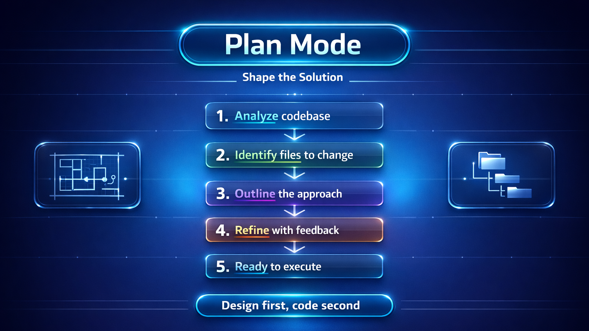

# 📐 Plan Mode — Shape the Solution



Plan mode helps you design a solution before writing code. It's the bridge between exploration (Ask mode) and execution (Agent mode).

## What Is Plan Mode?

In Plan mode, GitHub Copilot generates a **step-by-step implementation plan** based on your prompt. It analyzes your codebase, identifies the files that need to change, and outlines what to do — without doing it yet.

## When to Use It

- You know *what* you want to build but need to think through *how*
- A feature touches multiple files and you want to see the full picture first
- You want to review and adjust the approach before any code is generated
- You're working on something complex and want to break it into steps

## Try It — Walkthrough

### Scenario: Add a "priority" field to tasks

1. **Activate Plan mode** — Select **Plan** from the mode dropdown at the top of the Copilot Chat panel

2. **Describe what you want:**
   ```
   Add a priority field to tasks. It should be "low", "medium", or "high" with a default of "medium".
   Users should be able to filter tasks by priority.
   ```

3. **Review the plan** — Copilot will outline:
   - Update the task model to include a `priority` field
   - Add validation for allowed priority values
   - Update the POST and PUT routes to accept `priority`
   - Add a `?priority=high` query parameter to the GET route
   - Update the frontend to display and set priority

4. **Refine if needed** — Ask Copilot to adjust:
   ```
   Also add a visual indicator (color dot) for each priority level in the frontend.
   ```

5. **Execute** — When you're happy with the plan, switch to Agent mode to implement it.

## 💡 Tips

- **Plan before you leap.** Even for features that seem simple, a quick plan can catch edge cases.
- **Iterate on the plan.** Plans aren't final — ask Copilot to add, remove, or reorder steps.
- **Use plans as checklists.** They give you a clear list of what's done and what's left.
- **Share plans with your team.** A plan is a great way to communicate your approach in a PR description.

## What Comes Next?

With your plan ready, move to [Agent Mode](./03-agent-mode.md) to let Copilot execute the changes across your project.
