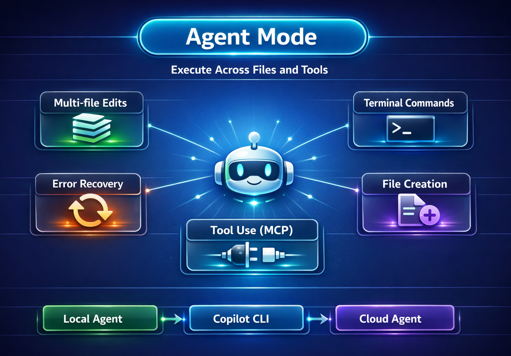

# 🤖 Agent Mode — Execute Across Files and Tools



Agent mode is where the magic happens. Copilot doesn't just suggest code — it **makes changes** across multiple files, runs terminal commands, and iterates until the job is done.

## What Is Agent Mode?

Agent mode gives GitHub Copilot the ability to:
- **Edit multiple files** in a single operation
- **Create new files** and directories
- **Run terminal commands** (install packages, run tests, start servers)
- **Iterate on errors** — if something breaks, it reads the output and fixes it
- **Use tools** via MCP (Model Context Protocol) for extended capabilities

It's like handing your plan to a developer who can touch every part of the project.

## When to Use It

- You have a clear plan (from Plan mode) and want Copilot to implement it
- A change spans multiple files (model, routes, frontend, tests)
- You want to scaffold new features end-to-end
- You need to refactor code across the project

## Try It — Walkthrough

### Scenario: Add a search endpoint

1. **Switch to Agent mode** — Select **Agent** from the mode dropdown at the top of the Copilot Chat panel

2. **Give a clear prompt:**
   ```
   Add a GET /api/tasks/search endpoint that accepts a ?q= query parameter
   and returns tasks whose title or description contains the search term.
   Also add a search box to the frontend that calls this endpoint.
   ```

3. **Watch Copilot work** — It will:
   - Add a search method to `TaskRepository.java`
   - Add a new endpoint in `TaskController.java`
   - Update `public/index.html` with a search input
   - May run `./mvnw spring-boot:run` to verify the changes work

4. **Review the changes** — Copilot shows a diff for each file. Accept, reject, or ask for adjustments.

## Agent Mode Superpowers

| Capability | Example |
|---|---|
| Multi-file edits | Update model, routes, and frontend in one go |
| Terminal commands | `./mvnw compile`, `./mvnw test`, `./mvnw spring-boot:run` |
| Error recovery | Reads test failures and fixes the code |
| File creation | Scaffolds new modules, test files, configs |
| Tool use (MCP) | Query databases, call APIs, fetch documentation |

## Agent Handovers

You can hand off an existing task from one agent type to another to take advantage of their unique strengths. For example, create a plan with a local agent, hand off to Copilot CLI for a proof of concept, then continue with a cloud agent to submit a pull request for team review.

To hand off a session, select a different agent type from the **session type dropdown** in the chat input box. VS Code creates a new session, carrying over the full conversation history and context. The original session is archived after handoff.

| From | To | Why |
|---|---|---|
| Local agent (Plan) | Copilot CLI | Run an autonomous proof of concept in the background |
| Copilot CLI | Cloud agent | Submit a polished PR for team review |
| Local agent | Cloud agent | Hand off a well-defined task to run on remote infrastructure |

In a Copilot CLI session, you can also delegate to a cloud agent by typing the `/delegate` command.

## 🛡️ Auto-Approve Safely with Dev Containers

Agent mode supports **auto-approve**, where Copilot executes file edits and terminal commands without asking. This is powerful but risky on your local machine.

**The solution: use a dev container or Codespace.** This project includes a [dev container](../.devcontainer/devcontainer.json) that isolates everything inside a disposable container. See the [Safe Auto-Approve with Dev Containers](../README.md#-safe-auto-approve-with-dev-containers) section in the README for full setup instructions.

> ⚠️ **Never use auto-approve on your bare local machine** unless you fully trust the task scope.

## 💡 Tips

- **Start with a plan.** Agent mode works best when you've already shaped the solution.
- **Be specific about scope.** "Add search to the API and frontend" is better than "Make the app better."
- **Review diffs carefully.** Agent mode is powerful but not infallible — always review.
- **Let it iterate.** If the first attempt has errors, Copilot will often fix them automatically.
- **Hand off between agents.** Start locally, then delegate to CLI or cloud agents for background or collaborative work.
- **Use a dev container for auto-approve.** It's the safest way to let Copilot run freely.

## What Comes Next?

Now that you know the three modes, learn how to give Copilot even more context with [copilot-instructions.md](04-copilot-instructions.md).
