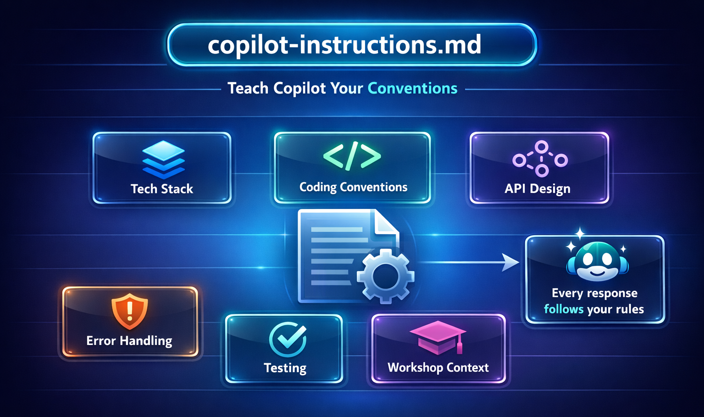

# 📄 copilot-instructions.md — Teach Copilot Your Conventions



The `copilot-instructions.md` file is how you teach GitHub Copilot the rules of **your** project. It's a simple Markdown file that lives in your repo and shapes every response Copilot gives.

## What Is It?

A file at `.github/copilot-instructions.md` that contains project-specific guidance:
- Coding conventions and style rules
- Tech stack details
- Architecture decisions
- Patterns to follow (or avoid)

Copilot reads this file automatically and applies its contents to all suggestions, chat responses, and agent actions.

## Why Does It Matter?

Without instructions, Copilot uses general best practices. With them, it generates code that **fits your project** — right naming conventions, right patterns, right error handling.

It's the difference between "here's some Spring Boot code" and "here's Spring Boot code that matches your team's style."

## What's in This Project's File?

Check out [`.github/copilot-instructions.md`](../.github/copilot-instructions.md) in this repo. It covers:

| Section | What It Does |
|---|---|
| Project Overview | Tells Copilot what this app is and its purpose |
| Tech Stack | Specifies Java 21, Spring Boot, vanilla frontend — no guessing |
| Coding Conventions | Constructor injection, PascalCase classes, camelCase methods |
| API Design | RESTful routes, JSON bodies, consistent error shapes |
| Error Handling | `@RestControllerAdvice`, no stack traces in responses |
| Testing | JUnit 5 and Spring Boot Test |
| Workshop Context | Reminds Copilot this is for learners — favor clarity |

## Try It — Experiment

1. **Open Copilot Chat** and ask:
   ```
   Create a new route for user profiles
   ```
   Notice how Copilot follows the conventions from the instructions file.

2. **Modify the instructions** — add a new rule:
   ```markdown
   ## Logging
   - Use SLF4J for all logging (`private static final Logger log = LoggerFactory.getLogger(MyClass.class)`)
   - Log at appropriate levels: ERROR for failures, WARN for recoverable issues, INFO for key events
   ```

3. **Ask Copilot again** and see how the output changes to include structured logging.

## 💡 Tips

- **Keep it concise.** Copilot works best with clear, bulleted guidance — not essays.
- **Be specific.** "Use camelCase" is better than "follow good naming conventions."
- **Update it as your project evolves.** New patterns? New rules? Add them.
- **One file per repo.** It lives at `.github/copilot-instructions.md` — Copilot finds it automatically.

## What Comes Next?

Instructions are project-wide. For role-specific guidance, check out [Agent Profiles (.agent.md)](./05-agent-profiles.md).
