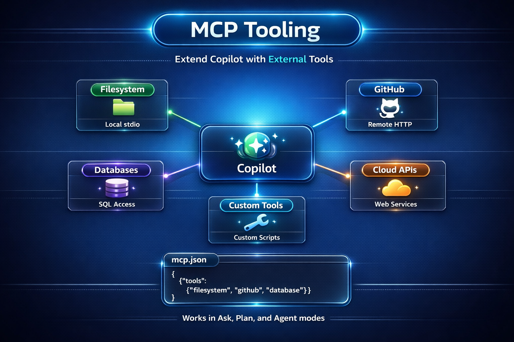

# 🔧 MCP Tooling — Extend Copilot's Reach



MCP (Model Context Protocol) gives GitHub Copilot access to **external tools and data sources** — turning it from a code assistant into a connected development partner.

## What Is MCP?

MCP is an open protocol that lets AI assistants interact with external servers. Each MCP server provides **tools** that Copilot can invoke from any chat mode:

- Read and write files with structured access
- Query databases
- Call APIs
- Fetch web content
- Interact with GitHub (issues, PRs, repos)
- And much more

## How It Works

1. You define MCP servers in `.vscode/mcp.json`
2. VS Code launches local servers on first use, and connects to remote servers automatically
3. Copilot discovers the available tools
4. Copilot calls these tools when needed — in any chat mode (Ask, Plan, or Agent)

## This Project's MCP Configuration

Check out [`.vscode/mcp.json`](../.vscode/mcp.json):

```json
{
  "servers": {
    "filesystem": {
      "command": "npx",
      "args": [
        "-y",
        "@modelcontextprotocol/server-filesystem",
        "${workspaceFolder}"
      ]
    },
    "github": {
      "type": "http",
      "url": "https://api.githubcopilot.com/mcp/"
    }
  }
}
```

| Server | Type | What It Does | Example Use |
|---|---|---|---|
| `filesystem` | Local (stdio) | Structured file access | "Read all controller files and summarize the API" |
| `github` | Remote (HTTP) | GitHub API access | "Create an issue for the missing validation bug" |

## Try It — MCP in Action

### Interact with GitHub
```
Create a GitHub issue titled "Add task priority feature" with a description of the requirements
```
Copilot uses the `github` server to create the issue directly.

### File Analysis
```
Read all files in src/main/java/com/vibetracker/controller/ and generate an API documentation table
```
Copilot uses the `filesystem` server to read the files and produces structured output.

## Adding Your Own MCP Servers

The MCP ecosystem is growing. You can add servers for:

- **Databases:** PostgreSQL, SQLite, MongoDB
- **Cloud:** AWS, Azure, GCP management
- **APIs:** Slack, Jira, Linear, Notion
- **DevOps:** Docker, Kubernetes, Terraform
- **Custom tools:** Build your own MCP server for internal tools

### Example: Adding a SQLite Server

```json
{
  "servers": {
    "sqlite": {
      "command": "npx",
      "args": ["-y", "@modelcontextprotocol/server-sqlite", "./data/tasks.db"]
    }
  }
}
```

## 💡 Tips

- **Start small.** The filesystem and GitHub servers cover most needs.
- **Use environment variables** for secrets (API keys, tokens) — never hardcode them.
- **MCP tools work in all chat modes** — Ask, Plan, and Agent can all invoke tools.
- **Check the MCP registry** for community-built servers: [github.com/modelcontextprotocol/servers](https://github.com/modelcontextprotocol/servers)

## The Complete Workflow

You now have the full picture:

1. **Ask mode** → Explore and understand
2. **Plan mode** → Design the solution
3. **Agent mode** → Execute the changes
4. **copilot-instructions.md** → Project-wide conventions
5. **Agent profiles** → Role-specific expertise
6. **MCP tooling** → External tools and data

Vibe code with structure, context, and control. 🎶
